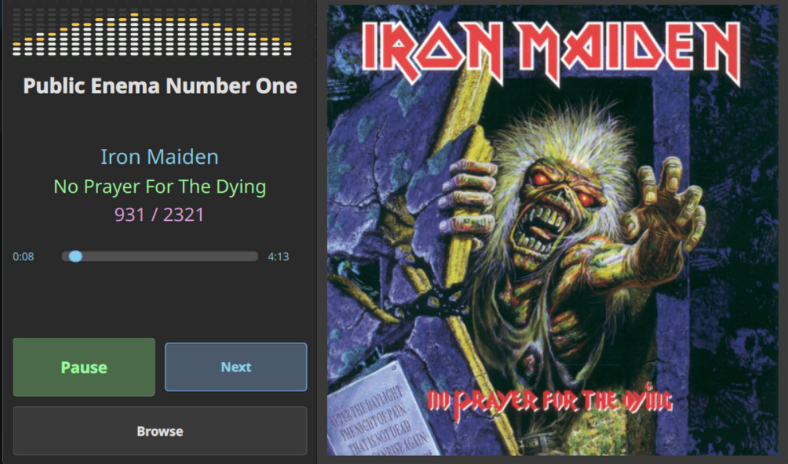

# Boombox



Boombox is a Qt6 + C++ audio player designed for Raspberry Pi (targeting Pi 5 touchscreen setups).

## What the app does

- Plays audio files from a selected folder (recursive scan)
- Uses random track selection for playback progression
- Provides a simple touchscreen-first UI:
  - **Play/Pause**
  - **Next**
  - **Browse**
  - Seek bar
- Persists last selected folder in `~/.boombox/config.json`
- Writes logs to `boombox.log` next to the executable

## Supported audio file extensions

`mp3`, `flac`, `wav`, `ogg`, `m4a`, `aac`, `wma`, `ape`

## Prerequisites

### Runtime dependencies

- Raspberry Pi OS (64-bit recommended)
- Qt6 runtime libraries
- `libmpv` runtime (for real playback)

> If linkable `libmpv` is not found at build time, Boombox builds with a stub backend and audio playback is unavailable.

### Build dependencies

- CMake 3.16+
- C++17 compiler toolchain (`g++`, `make`, etc.)
- Qt6 development packages (`qt6-base-dev`)
- `pkg-config`
- `libmpv-dev` (recommended, but not required if the runtime library is installed)

### Check whether mpv is installed

Check whether the runtime library is present:

```bash
ldconfig -p | grep libmpv
```

Check whether the development header is available:

```bash
pkg-config --modversion mpv
ls /usr/include/mpv/client.h
```

If `ldconfig -p | grep libmpv` succeeds, Boombox can still build the real playback backend even when `pkg-config --modversion mpv` or `ls /usr/include/mpv/client.h` fails. The development package is still recommended.

### Install mpv if missing

On Raspberry Pi OS / Debian:

```bash
sudo apt update
sudo apt install -y libmpv2 libmpv-dev
```

If you only need the runtime library:

```bash
sudo apt update
sudo apt install -y libmpv2
```

Then rebuild:

```bash
cmake -S . -B build -DCMAKE_BUILD_TYPE=Release
cmake --build build
```

## Quick start (local build)

```bash
git clone <repository-url> boombox
cd boombox
cmake -S . -B build -DCMAKE_BUILD_TYPE=Release
cmake --build build -j4
```

Run:

```bash
./build/bin/boombox
```

Fullscreen mode:

```bash
./build/bin/boombox --fullscreen
```

## CLI commands for users

Boombox currently supports one runtime flag:

- `--fullscreen` — starts the window in fullscreen mode

Common user shell commands:

```bash
# Start app in windowed mode
./build/bin/boombox

# Start app in fullscreen mode
./build/bin/boombox --fullscreen

# Follow logs (log file is written beside the executable)
tail -f ./build/bin/boombox.log
```

## Raspberry Pi OS installation (full guide)

For full installation, deployment, service setup, and troubleshooting on Raspberry Pi OS, see:

- [`DEPLOYMENT.md`](./DEPLOYMENT.md)

Quick auto-install on Raspberry Pi OS:

```bash
sudo ./scripts/install_raspberry_pi_os.sh
```

Quick update on Raspberry Pi OS:

```bash
sudo ./scripts/update_raspberry_pi_os.sh
```

## Useful developer commands

```bash
# Build
cmake --build build

# Run logger test binary
./build/bin/test_logger_exe

# Run error handling test binary
./build/bin/test_error_handling
```
